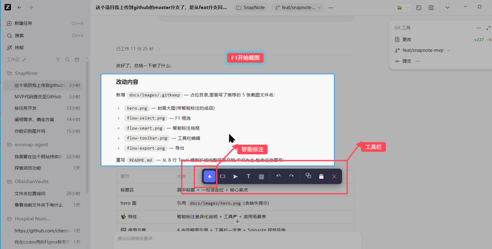
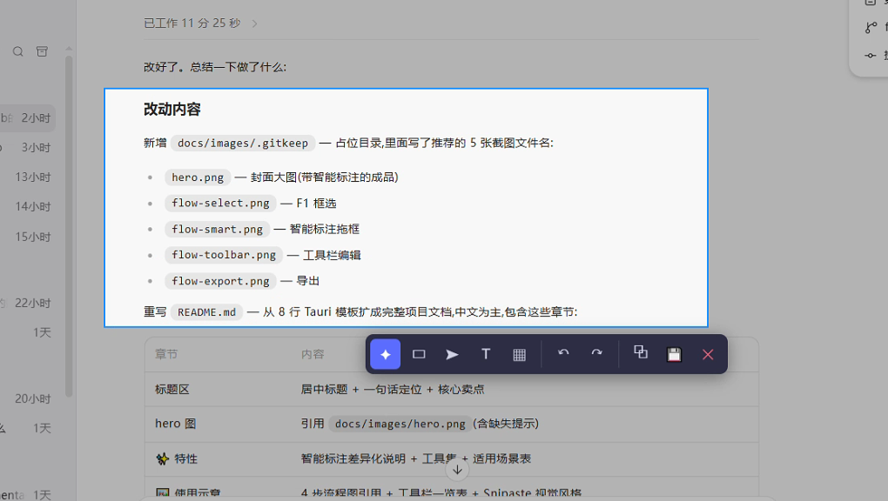
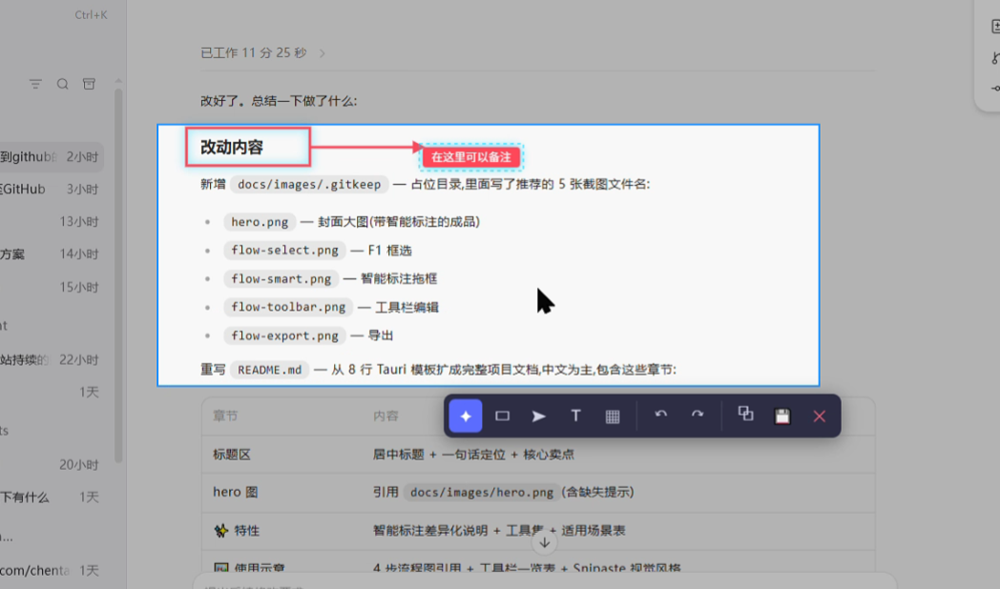
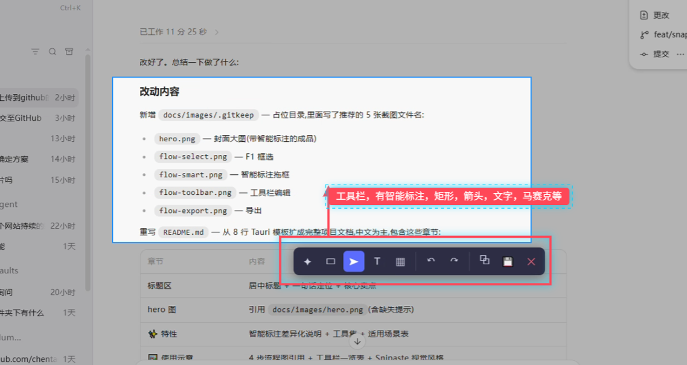
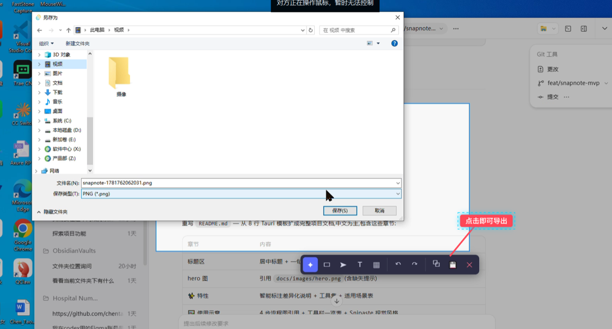

<div align="center">

# SnapNote

**Windows 桌面截图批注工具 · 对标 [Snipaste](https://zh.snipaste.com/)**

核心卖点:**「智能标注」工具** —— 在截图上拖一个框,一步生成「红框 + 箭头 + 文字标签」组合,
无需像传统工具那样分别切换矩形 / 箭头 / 文字工具。

</div>

---

<!-- 把演示截图放到 docs/images/ 下，下面这几张就会自动渲染。文件名见 docs/images/.gitkeep -->



## ✨ 特性

- **🎯 智能标注(差异化卖点)**
  - 在截图上拖一个框 → 自动从离鼠标**最近的角**射出箭头 → 跟随鼠标 → 点击定终点 → 一步生成「红框 + 箭头 + 文字标签」
  - 传统流程要切换 3 次工具,这里只需 1 次拖拽 + 1 次点击
  - V0.2 起标签朝箭头方向延伸、箭头连接最近的标签边、终点固定不再漂移
- **🧰 完整标注工具集**:智能标注 / 矩形 / 箭头 / 文字 / **马赛克**(V0.2 新增椭圆形状)
- **🎨 每工具样式自定义**(V0.2 新增):矩形 / 箭头 / 文字 / 智能标注各自记忆线宽(1–8px)、形状(矩形/椭圆),重启后保留
- **✂️ 可调裁剪区**(V0.2 新增):截图进入编辑器后还能再拖动调整裁剪范围,不必重新截图
- **🔢 自动序号标注**(V0.3 新增):智能标注 / 矩形 / 箭头 / 文字自动生成全局递增编号块,智能标注默认开启、其余可选;编号位置、形状(方形/圆角/圆形)、颜色、字号可自定义并持久化,删除不重排、撤销重做编号确定性,复制/保存导出均包含
- **🖱️ 多标注并存**:一张截图支持 N 个标注,可选中、移动、改字、删除
- **⌨️ Snipaste 式两阶段流程**:`F1` 框选 → 工具栏编辑
- **↩️ 撤销 / 重做**:`Ctrl+Z` / `Ctrl+Y`
- **📤 多种导出**:PNG / JPG 保存,一键复制到剪贴板
- **🚀 常驻后台**:`F1` 全局热键 + 开机自启(可选)+ 系统托盘
- **🪶 轻量打包**:基于 Tauri 2,单 exe ≈ 10MB,NSIS 安装包 + 便携版

### 适用场景

| 场景 | 说明 |
|------|------|
| 日常问题反馈 | 产品 / UI / 实施验收,截图圈出问题点直接发出去 |
| 医疗信息化项目 | 需求评审、系统验收、缺陷反馈,标注后导出成图归档 |
| 文档与教程 | 给操作步骤配带箭头说明的截图 |

---

## 🖼️ 使用示意

> 以下为流程示意图位置。请按 `docs/images/.gitkeep` 里的文件名放入截图即可显示。

### 1️⃣ 按 `F1`,框选要标注的区域



### 2️⃣ 选「智能标注」工具,拖一个框

箭头自动从**离鼠标最近的角**射出,跟随鼠标移动:



### 3️⃣ 点一下确定箭头终点,自动生成「红框 + 箭头 + 文字标签」

在弹出的文字框里输入说明,即可一步完成「矩形 + 箭头 + 文字」三件套:



### 4️⃣ 复制到剪贴板 或 保存为 PNG / JPG



### 5️⃣ 调整样式(V0.2 新增)

点击矩形 / 箭头 / 文字 / 智能标注工具会展开样式面板,可调线宽(1–8px)、矩形/椭圆形状,设置自动记忆:


> 📷 *样式面板示意图待补充*

### 6️⃣ 调整裁剪区(V0.2 新增)

进入编辑器后若发现截图范围不对,可直接拖动裁剪框边缘调整,无需重新按 F1:


> 📷 *可调裁剪区示意图待补充*

### 工具栏一览

| 工具 | 作用 |
|------|------|
| 智能标注 | 拖框生成「红框 + 箭头 + 文字」组合(本工具核心) |
| 矩形 | 画红框 / 椭圆轮廓(V0.2) |
| 箭头 | 画箭头 |
| 文字 | 添加文字标签 |
| 马赛克 | 局部打码 |
| 复制 | 复制到剪贴板 |
| 保存 | 导出 PNG / JPG |

> V0.2 起:矩形 / 箭头 / 文字 / 智能标注工具按钮会**展开样式二级面板**,可调线宽与形状。

视觉风格沿用 Snipaste 经典:**3px 线宽(可调)、`#ff4757` 主色、字体跟随系统**。

---

## 🏗️ 技术栈与架构

| 层 | 选型 | 理由 |
|----|------|------|
| 桌面框架 | **Tauri 2.x** | 单 exe 打包(~10MB)、复用 WebView2、Rust 原生系统能力 |
| 前端 | **React 18 + TypeScript + Vite** | 类型安全、生态成熟、AI 协作友好 |
| 画布 | **Konva.js** | 声明式 Canvas,内置事件 / 拖拽 / 变换,适合标注编辑器 |
| 状态管理 | **Zustand** | 比 Redux 轻,比 Context 易测 |
| 样式持久化 | **localStorage**(V0.2) | 每工具线宽/形状记忆,无需后端 |
| 截图底层 | **xcap**(Rust crate) | 依赖少、能最快跑通主流程 |
| 全局热键 | `tauri-plugin-global-shortcut` | 封装 Win32 `RegisterHotKey` |
| 剪贴板 | `tauri-plugin-clipboard-manager` | 写图片到系统剪贴板 |
| 开机自启 | 注册表 `HKCU\...\Run` + `winreg` | 原生 Windows 机制 |

### 进程 / 窗口模型

```
┌─────────────────────────────────────────────────────────┐
│                    Tauri 主进程 (Rust)                    │
│  ┌──────────────┐  ┌──────────────┐  ┌───────────────┐  │
│  │ screenshot   │  │ hotkey (F1)  │  │ clipboard     │  │
│  │ (xcap)       │  │              │  │               │  │
│  └──────┬───────┘  └──────┬───────┘  └───────┬───────┘  │
│         └─────────┬───────┴──────────────────┘          │
│         ┌─────────▼──────────┐                          │
│         │  IPC bridge        │                          │
│         └─────────┬──────────┘                          │
└───────────────────┼─────────────────────────────────────┘
                    │ invoke / event
┌───────────────────┼─────────────────────────────────────┐
│              前端 WebView (React + Vite)                 │
│         ┌─────────▼──────────┐                          │
│         │  Zustand Store     │                          │
│         │  - annotations[]   │                          │
│         │  - history stacks  │                          │
│         └─────────┬──────────┘                          │
│         ┌─────────▼──────────┐                          │
│         │  Konva Stage       │                          │
│         │  - 背景截图          │                          │
│         │  - 标注层 / 覆盖层    │                          │
│         └────────────────────┘                          │
└─────────────────────────────────────────────────────────┘
```

三个窗口职责分明:**主窗口**(隐藏,承载托盘入口与未来的设置)、**截图选区窗口**(F1 触发时创建,确认后销毁)、**编辑器窗口**(选区确认后创建,导出 / Esc 后销毁)。日常截图流程不经过主窗口。

> 完整设计见 [`docs/superpowers/specs/2026-06-17-snapnote-design.md`](docs/superpowers/specs/2026-06-17-snapnote-design.md)。

---

## 🚀 快速开始

### 环境要求

- **Windows 10 / 11 x64**(仅支持 Windows,不做 macOS / Linux)
- [Node.js](https://nodejs.org/) ≥ 18(开发用)
- [Rust](https://www.rust-lang.org/) ≥ 1.75(开发用,Tauri 后端)
- WebView2 运行时(Windows 11 自带,Windows 10 需安装)

### 从源码运行

```bash
# 1. 安装依赖
npm install

# 2. 开发模式(带热重载,会启动 Tauri 窗口)
npm run tauri dev

# 3. 打包成 exe(产出 NSIS / MSI 安装包 + 便携版 exe)
npm run tauri build
```

> 打包产物位于 `src-tauri/target/release/bundle/`(NSIS 在 `nsis/`、MSI 在 `msi/`),裸 exe 在 `src-tauri/target/release/snapnote.exe`。

### 日常使用

1. 启动后程序驻留系统托盘。
2. 任意应用下按 `F1` → 进入框选模式。
3. 拖出要标注的区域 → 进入编辑器。
4. 用工具栏标注 → 复制 / 保存。

首次启动会询问是否**开机自启**,可在托盘右键菜单中切换。

---

## 📁 项目结构

```
SnapNote/
├── src/                       # 前端 (React + TS)
│   ├── windows/               # 三个窗口根组件:Main / Selector / Editor
│   ├── canvas/                # Konva 画布:Stage + layers/ + shapes/
│   ├── tools/                 # 每个工具一个 use*Tool.ts hook(产出 Annotation 数据)
│   ├── geometry/              # 纯几何算法(nearest corner 等),可单测
│   ├── store/                 # Zustand store
│   ├── ipc/                   # Tauri invoke/listen 类型化封装
│   ├── types/                 # Annotation / EditorState / ToolType 类型
│   └── components/            # Toolbar / TextInputOverlay 等组件
├── src-tauri/src/             # Rust 后端
│   ├── commands/              # screenshot / clipboard / save 等 Tauri command
│   ├── tray.rs                # 系统托盘
│   └── autostart.rs           # 开机自启(注册表)
├── docs/
│   ├── images/                # 演示截图(README 引用)
│   └── superpowers/           # 设计文档与实施计划
└── README.md
```

**分层原则**:`geometry/` `types/` `ipc/` 是纯逻辑模块,不依赖 React,可独立单测;工具 hook 只产出数据,Shape 组件只渲染,职责分离。

---

## 📋 项目状态

- ✅ **V0.1.0 (MVP)**:截图、智能标注、矩形/箭头/文字/马赛克、多标注、撤销重做、导出、托盘、开机自启
- ✅ **V0.2.0**:每工具样式自定义(线宽/形状)、可调裁剪区、椭圆形状、智能标注几何优化
- ✅ **V0.3.0**:自动序号标注(智能标注/矩形/箭头/文字)、全局递增、位置与样式自定义、持久化
- 🚧 后续阶段:问题清单 `.md` 导出、AI 分析(识别 UI / 字段问题)

实施计划见 [`docs/superpowers/plans/2026-06-17-snapnote-mvp.md`](docs/superpowers/plans/2026-06-17-snapnote-mvp.md)。

---

## 📦 下载

前往 [Releases 页面](https://github.com/chentao4183/SnapNote/releases) 获取最新版本。

| 版本 | 说明 |
|------|------|
| [**v0.3.0**](https://github.com/chentao4183/SnapNote/releases/tag/v0.3.0)(最新) | 自动序号标注:智能标注/矩形/箭头/文字全局递增编号、位置与样式(形状/颜色/字号)可自定义 |
| [v0.2.0](https://github.com/chentao4183/SnapNote/releases/tag/v0.2.0) | 每工具样式自定义、可调裁剪区、椭圆形状、智能标注优化 |
| [v0.1.0](https://github.com/chentao4183/SnapNote/releases/tag/v0.1.0) | 首个 MVP 版本 |

每个 Release 提供:
- **NSIS 安装包**(`*-setup.exe`)— 推荐,双击安装,自动处理依赖
- **MSI 安装包**(`*.msi`)— 企业 IT 批量分发
- **便携版**(`*-portable.exe`)— 免安装,需系统已装 WebView2

> ⚠️ 仅支持 **Windows 10 / 11 x64**。便携版依赖系统 WebView2,旧系统(Win10 早期版本/LTSC)若无 WebView2 请改用安装包。

---

## ⚠️ 许可与免责声明

### 许可证

本项目暂未指定开源许可证。在添加 LICENSE 文件之前,**默认所有权利保留(All Rights Reserved)**:
- ✅ 你可以 fork 并阅读、学习源码
- ❌ 未经授权请勿直接用于商用、再分发或二次发布

如需商用授权或希望以 MIT / Apache-2.0 等许可证开源,请联系作者。

### 免责声明

- 本工具**仅支持 Windows x64**,不在 macOS / Linux 上运行。
- 截图内容可能涉及隐私或敏感信息,**用户自行承担使用风险**。作者不对因使用本工具导致的任何信息泄露或损失负责。
- 本项目对标 Snipaste 的交互理念但为**独立实现**,与 Snipaste 无任何关联或从属关系。
- "Snipaste" 是其各自所有者的商标,本项目仅用于说明产品定位。

---

<div align="center">

**如果这个项目对你有帮助,欢迎 ⭐ Star**

</div>
